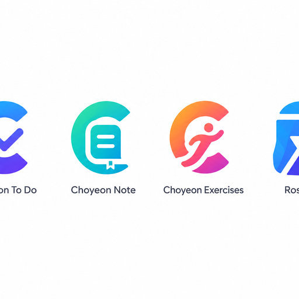

<div align="center">



# Choyeon To Do

**A lightweight task manager for people who want to get things done.**

[Features](#features) · [Download](#download) · [Getting Started](#getting-started) · [Development](#development)

[](https://github.com/Choyeon/choyeon-todo/releases)
[](./LICENSE)

</div>

---

## Features

- Smart input — type naturally, dates and priorities are detected as you go
- Pomodoro timer with configurable work/break cycles
- Calendar view with drag-to-reschedule
- Statistics and daily / weekly reviews
- Category + tag organization with custom filters
- Global keyboard shortcuts
- Light / dark theme (follows system, or manual toggle)
- Local storage, JSON / CSV import & export
- Desktop app with tray, notifications, and floating mini window
- PWA-ready — installable and offline-capable
- i18n: 简体中文 · English · 日本語

## Download

Prebuilt installers are available on the [Releases](https://github.com/Choyeon/choyeon-todo/releases) page.

| Platform | Installer |
| :--- | :--- |
| Windows (64-bit) | `Setup-x.x.x.exe` |
| Windows Portable | `Portable-x.x.x.exe` |

## Getting Started

### Prerequisites

- Node.js >= 18
- npm >= 9

### Install

```bash
npm install
```

### Run in the browser

```bash
npm run dev
```

Then open <http://localhost:5173>.

### Run as desktop app

```bash
npm run electron:dev
```

### Build

```bash
# Web only
npm run build

# Desktop installer (Windows)
npm run electron:build:win
```

## Development

```bash
npm run test           # run tests in watch mode
npm run test:run       # run all tests once
npm run test:coverage  # run tests with coverage report
npm run lint           # ESLint check
npm run lint:fix       # auto-fix lint issues
npm run format         # Prettier formatting
```

## Project Structure

```
choyeon-todo/
├── build/             # app icons (PNG + ICO)
├── electron/          # Electron main + preload
├── public/            # static assets
├── scripts/           # utility scripts (a11y, i18n, latest.yml)
├── src/
│   ├── components/    # reusable Vue components
│   ├── composables/   # Vue 3 composition utilities
│   ├── locales/       # i18n translations (zh, en, ja)
│   ├── stores/        # Pinia state stores
│   ├── views/         # page-level Vue views
│   ├── App.vue
│   └── main.js
├── tests/             # Vitest test suite
├── package.json
├── vite.config.js
└── vitest.config.js
```

## Stack

| Layer | Technology |
| :--- | :--- |
| UI | Vue 3 + Vite |
| State | Pinia |
| Desktop | Electron |
| Testing | Vitest |
| Lint | ESLint + Prettier |

## License

MIT © Choyeon
